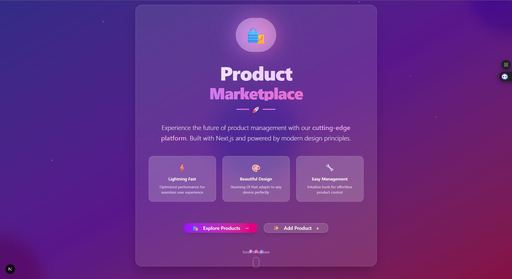

# 🛍️ Product Marketplace App

A sleek and modern product listing web application built with **Next.js 14**, **TypeScript**, and **ShadCN UI**. Users can browse, add, and delete products in a beautiful, responsive interface styled with gradients, dark mode, and smooth animations.



---

## 🔧 Tech Stack

- **Next.js 14 (App Router + Server Components)**
- **TypeScript**
- **ShadCN UI** (built on Radix & Tailwind CSS)
- **Tailwind CSS** (custom dark theme, gradient backgrounds, blur effects)
- **Lucide React** (icons)
- **Sonner** (toast notifications)
- **React Hook Form + Zod** (form validation)
- **Lottie Player** (welcome animation)

---

## 🚀 How to Run the Project

### 1. Clone the repo

```bash
git clone https://github.com/your-username/product-gallery-app.git
cd product-gallery-app
```

### 2. Install dependencies

```bash
npm install
# or
yarn
```

### 3. Run the development server

```bash
npm run dev
```

Visit [`http://localhost:3000`](http://localhost:3000) to view the app in your browser.

---

## 📦 Folder Structure

```
/app              → Next.js app directory (routes, pages)
/components       → UI components (cards, buttons)
/lib              → Dummy product data
/public           → Static files and icons
/styles           → Global CSS & Tailwind configs
```

---

## 📝 Notes & Assumptions

- Products are currently stored in a **temporary in-memory array** (`/lib/data.ts`). No database is connected.
- Images use external URLs or a placeholder. Broken URLs may result in missing previews.
- All styles are built with **utility classes** using **Tailwind** and **ShadCN design tokens**.
- The app is fully responsive and optimized for both light and dark themes (default: dark).
- This is intended as a **frontend showcase** (internship assignment), not a production-ready system.

---

## ✨ Features

- 📦 Add, view, and delete products
- 🔍 Search products by name
- 🧊 Animated skeleton loaders during loading/deletion
- 🧠 Accessible components with keyboard and screen reader support
- 💅 Animated gradients, blur effects, hover tilts, and glowing shadows
- 🛠 Built with modular and clean code for easy extension

---

## 📸 UI Preview

### Landing page 


### Product list page


### Add Product page 


### View Product page 


---

